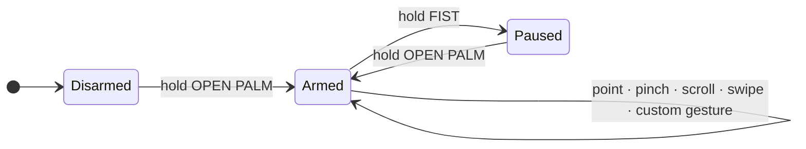
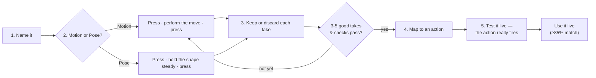

# AirControl

[](https://github.com/rajdeeepm/AirControl/actions/workflows/ci.yml)


> **Control your desktop with your bare hand in the air.** AirControl turns an ordinary
> laptop webcam into a pointing device — move the mouse, click, scroll, manage
> windows, and fire your own custom gestures, all without touching anything.

It watches your hand, recognizes a small, deliberate set of gestures, and
translates them into mouse movement, clicks, scrolling, and window management.

**Privacy first.** All hand tracking runs on your own computer. AirControl works
from the 21 hand-skeleton landmarks that MediaPipe extracts locally — it never
uploads, streams, or saves camera video. Nothing about your camera leaves the
machine.

The camera always starts **disarmed**. No input reaches your desktop until you
deliberately arm control with an open-palm hold.

> **New here?** Read the **[complete step-by-step instructions](INSTRUCTIONS.md)**
> — every feature, every gesture, and how to record your own, with nothing
> assumed.

---

## Highlights

| | |
|---|---|
| **Touchless pointing** | Point to move the cursor, pinch to click and drag |
| **One- or two-hand modes** | Two-hand "modifier" design makes clicks and drags explicit and deliberate |
| **Custom motion gestures** | Record a movement, map it to any action or keyboard shortcut |
| **Custom hand-pose gestures** | Hold a distinct shape (Spock, horns, shaka…) as a trigger — not just movements |
| **Strict, detailed matching** | Requires a ≥85% match and weighs palm orientation, finger spread and fold, so shapes don't get confused |
| **Airy companion** | A small always-on-top widget that names what the system is doing |
| **Guided calibration** | Personalizes arming and motion thresholds to you |

**Want the how-to for each of these?** See the
**[complete instructions](INSTRUCTIONS.md)**.

---

## What you need

- **x64 Windows 10 or 11**, or **macOS 12+** (Apple silicon or Intel)
- A working webcam
- **Python 3.11+** — on Windows install it with the Python Launcher option
  ([python.org](https://www.python.org/downloads/windows/)); on macOS use
  Homebrew (`brew install python@3.12`) or python.org
- **Node.js** LTS ([nodejs.org](https://nodejs.org/en/download)) — builds the
  desktop UI once during setup

## Install — clone and run

**Windows:**

```cmd
git clone https://github.com/rajdeeepm/AirControl.git
cd AirControl
setup.cmd
app.cmd
```

**macOS:**

```bash
git clone https://github.com/rajdeeepm/AirControl.git
cd AirControl
./setup.sh
./app.sh
```

That is the whole thing. The **setup** script does the one-time work — it creates
a private `.venv`, installs AirControl, builds the desktop UI, and downloads the
hand-tracking model — then the **app** script opens the app. On Windows both are
double-clickable from Explorer if you would rather not use a terminal.

If Python or Node is missing, setup prints the official download link and stops
without changing any system settings. The app script re-runs setup by itself if
the environment or the UI bundle is ever incomplete, so you can always just run
it again.

> **macOS needs two permissions.** **Camera**, which every platform asks for,
> and **Accessibility**, which is macOS-specific: it will not let any
> application move your pointer until you allow it, under **System Settings >
> Privacy & Security > Accessibility**. Grant it and **restart the app**.
> Without it macOS silently discards every event AirControl sends, so gestures
> are recognized and the HUD reacts but nothing moves — which looks exactly
> like broken gesture recognition. Practice mode (`./app.sh --practice`) needs
> only the camera. Full first-run walkthrough: [Getting started](#getting-started).

Everything else — calibration, recording gestures, mapping actions, settings —
happens inside the app. Nothing else needs a terminal.

> **Prefer not to install Python and Node?** A packaged
> **`AirControl-Setup.exe`** is attached to the
> [latest release](https://github.com/rajdeeepm/AirControl/releases). It installs
> the same app with no toolchain required. Cloning is the path this project is
> built around, and gets you fixes as soon as they land.

## Getting started

1. **Open the app.** Run `app.cmd` (Windows) or `./app.sh` (macOS). It opens the
   native desktop window (hosted with `pywebview`, not a browser tab) and, when
   enabled in settings, the Airy companion in the same session. Control begins
   disarmed.
2. **Clear the first-run prompts.** These appear once, in this order, and the
   first one is easy to miss:
   - **The privacy notice appears in the terminal, not in the app window.**
     Running from a clone, AirControl prints a notice about MediaPipe's
     telemetry and waits for you to type `AGREE` and press Enter. It will not
     start until you do — if the app window seems stuck, look at the terminal.
   - **Camera permission.** macOS and Windows both ask. Without it you get a
     black preview and no tracking.
   - **Accessibility permission (macOS only).** System Settings > Privacy &
     Security > Accessibility, then **restart the app**. Skipping this is the
     confusing one: gestures are recognized and the HUD reacts, but macOS
     silently discards every event, so nothing moves. It looks like broken
     recognition and is not.
3. **Calibrate.** Open the **Calibration** screen and press **Start
   calibration** — the whole guided flow runs in the app, with a live preview
   and step-by-step prompts. It personalizes arming and motion thresholds
   through: framing, hand size, motion speed, a ~30-second normal-work capture
   (so incidental desk motion is learned and rejected), and a lighting check.
   The saved profile is your active calibration.
4. **Arm control.** With your dominant hand, hold an **open palm** facing the
   camera until it arms.
5. **Use gestures.** Move the pointer, click, scroll, and manage windows. Hold a
   **fist** to pause.



> Want to try recognition without touching your desktop? Run `practice.cmd` /
> `./app.sh --practice` (or open
> the app in practice mode). It shows the actions it *would* perform but never
> sends real input.

## Interaction model

AirControl supports one- and two-hand interaction.

### Single-hand mode

| Gesture | Action |
|---|---|
| Hold an **open palm** ✋ (dominant hand) | Arm control |
| Hold a **fist** ✊ | Pause and cancel the active gesture |
| **Point** ☝️ with the index finger | Move the pointer like a relative touchpad |
| **Pinch** 🤏 thumb to index (other fingers folded) | Mouse button down; the pointer freezes as the pinch approaches so the click lands where you aimed |
| **Release** the pinch | Mouse button up — a quick pinch is a click, a moving pinch is a drag |
| **Two fingers** ✌️ (index + middle) moved vertically | Two-finger scroll |
| **Three-finger swipe left / right** | Next / previous app |
| **Three-finger swipe up** | Task View |
| **Three-finger swipe down** | Show desktop |

Every active pose must stay stable for a short dwell before it takes ownership,
and swipe distances are normalized by hand size, so moving closer to the camera
does not multiply sensitivity. A three-finger swipe fires once and must be
released before it can fire again.

### Two-hand mode (modifier design)

Two-hand mode makes clicks and drags explicit and deliberate. The **dominant
hand** always points and does **all** the pinching. The **non-dominant hand** is
a *modifier* that only chooses what the dominant pinch does:

| Non-dominant hand | Dominant pinch behaves as |
|---|---|
| **Open palm** ✋ | Cursor **locks** where the dominant hand is pointing, and the pinch **left-clicks** at that exact spot |
| **Fist** ✊ | Pinch **holds** the button so movement **drags** |
| No modifier (neutral) | The pointer keeps moving, and the pinch does **nothing** — so a click never happens by accident |

Only the **dominant hand's fist** disarms control; the modifier hand never
reaches the clutch.

## Custom gestures

Record your own gestures and map them to actions. A gesture can be a **motion**
(a movement, like drawing a circle) or a **pose** (a distinct held hand shape,
like a Spock sign 🖖) — you choose which when you record it.

> For the full walkthrough of recording, checks, mapping, and tips, see
> **[Custom gestures in the instructions](INSTRUCTIONS.md#7-custom-gestures--motions-and-poses)**.



1. **Name it.** On the **Gestures** screen choose **+ Add Gesture** (or run
   `record.cmd`), and pick **Motion gesture** or **Hand pose**.
2. **Record takes — you're in control.** Press **Record take** (or the spacebar);
   a short **3-2-1 countdown** gives you time to get set, then you perform.
   - For a **motion**, press again to stop; the take is auto-trimmed to your
     movement, at any speed.
   - For a **pose**, hold the shape steady (a steadiness meter shows how you're
     doing), then press to capture.

   You review each take and **Keep** or **Discard** it. **3 to 5** kept takes
   are required — save once you have 3, or add up to 5 for extra reliability.
   Vary each take slightly (angle, distance, hand position), the same way a
   phone fingerprint scanner asks for a few presses at different angles — it
   gives AirControl a better sense of how you actually perform the gesture,
   not one exact snapshot. Keep performing the same gesture, though: takes
   that vary too wildly still fail the consistency check below.
3. **Honest, blocking checks.** When you save, AirControl runs consistency,
   confusability, and desk-motion checks and refuses — without wasting a take —
   with a plain-language reason, for example:
   - *"Your takes were too inconsistent — try again."*
   - *"Too similar to \<gesture\> — make this motion more distinct."*
   - *"This looks like normal desk motion — make it more distinct."*
   - *"Hold the pose steady."* (poses)
   - *"Too similar to a built-in pose — pick a more distinct shape."* (poses)
4. **Map it — right away.** Saving closes the dialog and takes you straight to
   mapping the new gesture: assign a **curated verb** grouped by category
   (Media, Windows, Reading and browser, and more), or use the **shortcut
   recorder**, which captures any key combination you press and turns it into
   a hotkey.
5. **Test it — for real.** Assigning the action opens a test dialog that
   exercises the real path: performing the gesture actually dispatches the
   mapped action, so you see it happen rather than a simulated match. One
   successful recognition passes. If it does not test well, **Try again**,
   **Re-record this gesture**, or (after a few misses) **Skip for now** —
   your mapping is already saved either way.

> **Good pose choices:** shapes that aren't already built in — Spock 🖖, horns
> 🤘, shaka 🤙, an "OK" ring 👌. A plain flat palm ✋, fist ✊, point ☝️, or
> pinch 🤏 stay reserved for arming, pausing, and clicking.

**How many custom gestures can you create?** There is **no fixed limit** — add as
many as you like; each just needs a **unique name**. In practice, keep them
distinct: every new gesture must pass the confusability check against the ones
you already have, similar gestures are harder to match at the ≥85% bar, and a
very large library uses more CPU (each attempt is compared against all your
gestures every frame). A dozen or two distinct gestures is a comfortable set.

### How recognition works

AirControl matches what you do against **your own recordings** — not a fixed
alphabet. It picks the closest of your gestures and fires only when the match is
strong and clearly beats the runner-up:

| It compares… | So it can tell apart… |
|---|---|
| Overall hand shape & (for motions) the path over time | Different movements and shapes |
| **Palm orientation** — facing toward vs away from the camera | The same shape shown two ways |
| **Finger spread** — the gaps between fingertips | A Spock split vs a flat palm |
| **Finger fold** — how curled each finger is | Extended vs tucked fingers |

A custom gesture fires only at **≥85% similarity**, and motions and poses never
cross-fire (a held shape can't trigger a movement gesture and vice-versa).

### Tuning

The **Settings** screen exposes the everyday **Response** controls (pointer
responsiveness, dominant hand, click mode). **Advanced tuning** adds finer
sliders — click engage/release distance, pinch approach distance, drag lock and
release motion, arm and pause hold times, scroll speed, and swipe distance —
plus a **Reset** to defaults. The **Calibration** screen reports the active
profile and lets you run guided calibration again, in-app.

##  The Airy companion

Airy is a frameless, always-on-top widget that reconnects to AirControl
automatically and always names its state:

- **Active** — connected and armed (*"Tracking your gestures"*)
- **Inactive** — connected but paused (*"Gesture tracking paused"*)
- **Offline** — AirControl is unreachable (*"AirControl is not running"*)

Click Airy to arm or pause. Drag it to reposition (its position is remembered),
and click the small **×** to hide it. Airy can also run on its own with
`python -m aircontrol --widget`.

## Launchers

These are how you run AirControl from a clone. Each one bootstraps the
environment via the setup script on first use, so you can run any of them
directly.

**Windows** — the `.cmd` files, all double-clickable:

| Launcher | Purpose |
|---|---|
| `setup.cmd` | One-time setup: Python environment, AirControl, desktop UI, hand model |
| `app.cmd` | Open the live native desktop app (with Airy in the same session) |
| `start.cmd` | Run live desktop control without the app window |
| `practice.cmd` | Recognize gestures without controlling the desktop |
| `calibrate.cmd` | Run guided calibration from a terminal (the app's Calibration screen does this in-app; this is a developer/scripting alternative) |
| `record.cmd` | Record a custom gesture (optionally pass its name) |
| `arena.cmd` | Practice recorded gestures; pass `stress` for the false-fire test |

**macOS** — two scripts, since the rest are one-liners:

| Launcher | Purpose |
|---|---|
| `./setup.sh` | The same one-time setup as `setup.cmd` |
| `./app.sh` | Open the desktop app; arguments pass through, so `./app.sh --practice` sends no real input |

Every other mode is `.venv/bin/python -m aircontrol --<mode>` — `--practice`,
`--calibrate`, `--record-gesture "name"`, `--arena`, `--widget`, or no flag for
live control without the app window.

To open the desktop app without sending real input, run
`python -m aircontrol --app --practice`.

## Privacy and safety

- Hand tracking runs entirely on your computer. AirControl never uploads or saves
  camera frames, and works offline after the initial model download.
- Only hand-skeleton landmarks — never video — drive recognition. When the app
  preview is enabled, only annotated JPEG frames travel in RAM over the
  `127.0.0.1` loopback socket for the local UI; they are never written to disk or
  sent off the machine.
- Calibration profiles, gesture exemplars (landmark trajectories only), and
  action mappings live in a local SQLite store under `%LOCALAPPDATA%\AirControl`.
  A **delete-everything** operation on the Settings screen removes all of it.
- On first launch, AirControl shows a required notice: MediaPipe keeps
  camera/input data on-device but separately reports performance and
  API-utilization metrics to Google when a connection is available. AirControl
  starts only after explicit consent. To withdraw consent from an installed app,
  delete `%LOCALAPPDATA%\AirControl\.aircontrol-consent.json`; when running from
  a clone, delete `.aircontrol-consent.json` beside the active config file. The notice
  appears again and AirControl will not start until consent is given.
- Losing the hand releases a drag after a short grace period. A stalled camera or
  model triggers an independent watchdog that pauses control; keeping your hand
  away for a few seconds also pauses it.
- Default commands are navigation-only — there are no delete, close, send,
  purchase, or shell gestures.
- Windows blocks normal applications from injecting input into
  administrator/elevated windows and secure screens. AirControl does not request
  elevation or work around that protection.

## Building the optional installer

Running from a clone needs none of this. The packaged `AirControl-Setup.exe` is
built on tag pushes by [`.github/workflows/release.yml`](.github/workflows/release.yml)
for people who would rather not install Python and Node. To build it locally,
use Python 3.11 on Windows:

```powershell
npm --prefix ui install
npm --prefix ui run build
py -3.11 -m pip install -e . pyinstaller
py -3.11 -c "from aircontrol.model import ensure_hand_model; ensure_hand_model('models/hand_landmarker.task')"
py -3.11 -m PyInstaller packaging/aircontrol.spec
& "${env:ProgramFiles(x86)}\Inno Setup 6\ISCC.exe" packaging\installer.iss
```

Keep `#define AppVersion` in `packaging/installer.iss` synchronized with
`project.version` in `pyproject.toml` whenever the release version changes.

## Development

After `setup.cmd`, from the project folder:

```powershell
.venv\Scripts\python.exe -m pytest
.venv\Scripts\python.exe -m aircontrol --practice
```

Recognition and desktop control are separated, so the whole gesture stack is
tested with synthetic landmark sequences — no camera required. The UI has its own
test suite (`npm --prefix ui run test`) and build (`npm --prefix ui run build`).

**Using an AI coding agent?** [AGENTS.md](AGENTS.md) orients agents like Codex or
Claude Code — how to set up, build, test, and the constraints to respect — so you
can ask one to install the project or explain how it works. (`CLAUDE.md` points
there too.)

## macOS support

AirControl runs on macOS. Recognition, matching, calibration, the store, the
IPC layer, the UI, and the whole test suite were already platform-independent;
what the port added is a Quartz input backend and a key translation layer.

**What differs from Windows:**

| | Windows | macOS |
|---|---|---|
| Next / previous app | Alt+Tab | Cmd+Tab |
| Overview | Task View | Mission Control |
| Show desktop | Win+D | F11 |
| Permission needed | none | Accessibility |

Everything else — the gestures, the two-hand modifier model, custom motions and
poses, calibration, Airy — behaves the same on both.

### How keys translate

Windows virtual-key codes are the project's portable currency for keys: the UI
records them, the store persists them, and each platform's sink translates them
on the way out. That keeps every layer above the sink platform-independent and
confines "what key is this really" to one module,
[`mac_keymap.py`](src/aircontrol/mac_keymap.py).

**Ctrl becomes Command.** Windows' Ctrl and macOS' Command fill the same role —
the modifier application shortcuts hang off — so Ctrl+T, Ctrl+W and Ctrl+C land
as Cmd+T, Cmd+W and Cmd+C and do what you meant. Mapping Ctrl to macOS Control
instead would be literally faithful and almost always wrong: Cmd+C copies,
Control+C does not.

A few shortcuts have no literal counterpart and are rewritten whole, because
translating them key-for-key would produce a working keystroke that does the
wrong thing:

| Verb | Windows | macOS |
|---|---|---|
| Browser back / forward | Alt+Left / Alt+Right | Cmd+Left / Cmd+Right |
| Refresh | F5 | Cmd+R |
| Screenshot | Win+PrtScn | Cmd+Shift+3 |

Volume and transport keys are not ordinary keystrokes on macOS at all — they
travel as system-defined events carrying an `NX_KEYTYPE_*` selector, so they
take a separate path.

### macOS permissions are not a toggle

On Windows, camera permission is a switch you flip next to AirControl's name.
macOS differs in three ways, each of which produces a confusing failure, so
AirControl now detects which one you have hit and says so instead of reporting
a generic camera error.

- **Permission belongs to whatever launched AirControl**, not to AirControl.
  Run `./app.sh` from a terminal and the prompt names *that terminal*; the row
  that appears under **System Settings > Privacy & Security > Camera** is
  Terminal or iTerm. **There is no AirControl entry to switch on** — looking
  for one is the most common wrong turn.
- **A denial is permanent.** macOS asks exactly once. Dismiss or deny it and
  it never asks again, it just fails. To get the prompt back:
  ```bash
  tccutil reset Camera
  ```
  then start AirControl again — or switch on the launching app in System
  Settings.
- **Authorized is not the same as working.** A camera can be authorized,
  connected, and idle yet still deliver no frames, usually because another
  app holds it (Zoom, FaceTime, Photo Booth, a browser tab that only looks
  closed). AirControl distinguishes this from a permission problem.

Accessibility, the second permission, behaves the same way — granted to the
launching app, asked once.

### Known gaps

- **The packaged installer is Windows-only.** There is no `.app` bundle or
  `.dmg`; on macOS, clone and run. That is the path this project is built
  around anyway.
- **Airy's window icon** is a `.ico`, which macOS ignores. Cosmetic only.
- **Elevated windows.** Just as Windows blocks input into elevated windows,
  macOS blocks synthetic input into secure input fields (password prompts).
  AirControl does not work around either.
- **Show desktop may need a keyboard setting.** It sends F11, the macOS
  default, but Mac laptops default the top row to brightness and volume, so
  bare F11 can do nothing. Turn on **Keyboard > Use F1, F2, etc. keys as
  standard function keys**, or remap Show Desktop to a chord. The other
  window verbs (Cmd+Tab, Mission Control) are unaffected.
- **Scroll direction is untested on hardware.** Synthetic scroll events should
  not be affected by macOS' "natural scrolling" setting, so direction should
  match Windows — but this has not been confirmed with a camera in hand. If
  yours comes out inverted, that is a one-line fix in `mac_input_sink.py`.

## Contributing

**Collaborators are very welcome.** Ideas, bug reports, gesture-recognition improvements,
UI work, and documentation fixes are all appreciated. Open an
[issue](https://github.com/rajdeeepm/AirControl/issues) to start a conversation,
or send a pull request.

Before proposing a change, run the Python suite and the UI build (see
[Development](#development)), and read the hard constraints in
[AGENTS.md](AGENTS.md#hard-constraints--do-not-break-these) — especially that
hand tracking stays on-device and that recognition stays separated from OS input,
since that separation is what keeps the tests camera-free.

## Built with

AirControl was built by Rajdeep Mukherjee with AI pair-programming:

- **Claude (Anthropic)** — planning, orchestration, and code review.
- **Codex (OpenAI)** — implementation.

Both appear as `Co-Authored-By` tags on commits for provenance; neither is a
project contributor.
